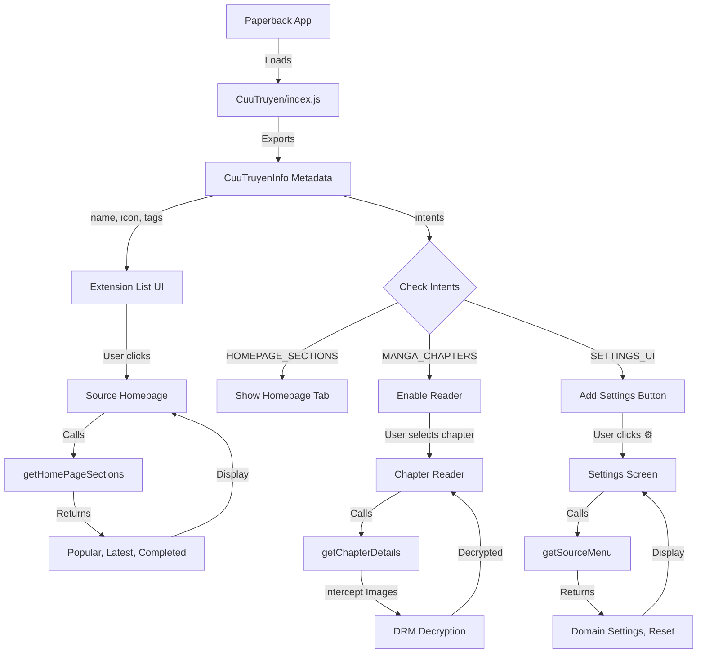

# CuuTruyen Extension: How index.js Connects source.js to Paperback UI

## 🔍 Key Discovery: index.js and source.js are IDENTICAL

First important finding: **Both files are exactly the same!** They're both 101KB with identical content. This is a **redundancy pattern** where:
- `source.js` is the main bundle
- `index.js` is a duplicate entry point (likely for compatibility)

---

## 📋 What Makes source.js Work with the Paperback UI

The connection happens through **metadata exports** at the start of the file. Here's what the UI needs:

### 1. **CuuTruyenInfo Object** (Lines 2488-2508)

This is the **contract** between your extension and Paperback's UI:

```javascript
exports.CuuTruyenInfo = {
    version: '1.0.2',                          // Extension version
    name: 'CuuTruyen',                         // Display name in UI
    icon: 'icon.png',                          // Icon shown in source list
    author: 'AlanNois',                        // Creator name
    authorWebsite: 'https://github.com/AlanNois',
    description: 'Extension that pulls manga from Cuutruyen',
    websiteBaseURL: 'https://cuutruyen.net',  // Base website
    contentRating: types_1.ContentRating.MATURE,  // Age rating
    
    // TAGS shown as badges in UI
    sourceTags: [
        {
            text: 'Recommended',
            type: types_1.BadgeColor.GREEN     // Green badge
        },
        {
            text: 'DRM protected',
            type: types_1.BadgeColor.YELLOW    // Yellow warning badge
        }
    ],
    
    // CAPABILITIES (binary flags)
    intents: types_1.SourceIntents.MANGA_CHAPTERS | 
             types_1.SourceIntents.HOMEPAGE_SECTIONS | 
             types_1.SourceIntents.SETTINGS_UI
};
```

---

## 🎯 UI Criteria Breakdown

### **Required Fields for Paperback UI:**

| Field | Type | Purpose in UI |
|-------|------|---------------|
| `version` | String | Shown in extension details, used for updates |
| `name` | String | **Extension title** displayed everywhere |
| `icon` | String | **Visual identifier** in source list |
| `author` | String | Credits shown in extension info |
| `authorWebsite` | String | Link to developer (opens in browser) |
| `description` | String | Help text explaining what the source does |
| `websiteBaseURL` | String | Original website link, cloudflare bypass |
| `contentRating` | Enum | `EVERYONE`, `MATURE`, or `ADULT` |
| `sourceTags` | Array | **Badges** displayed next to source name |
| `intents` | Binary | **Features enabled** in the UI |

---

## 🏷️ Source Tags (Badges)

These create **visual indicators** in the UI:

```javascript
sourceTags: [
    {
        text: 'Recommended',
        type: types_1.BadgeColor.GREEN  // ✅ Green badge
    },
    {
        text: 'DRM protected',
        type: types_1.BadgeColor.YELLOW  // ⚠️ Yellow warning
    }
]
```

**Available Badge Colors:**
- `BLUE` ("default") - Default badge
- `GREEN` ("success") - Recommended, working features
- `GREY` ("info") - Informational
- `YELLOW` ("warning") - Warnings, special requirements
- `RED` ("danger") - Errors, issues

---

## ⚙️ Intents: Feature Flags

The `intents` field uses **binary flags** to tell the UI what features to enable:

```javascript
intents: MANGA_CHAPTERS | HOMEPAGE_SECTIONS | SETTINGS_UI
// Binary: 1 | 4 | 32 = 37
```

**Available Intents:**

| Intent | Value | UI Feature Enabled |
|--------|-------|-------------------|
| `MANGA_CHAPTERS` | 1 | **Chapter reading** functionality |
| `MANGA_TRACKING` | 2 | Progress tracking support |
| `HOMEPAGE_SECTIONS` | 4 | **Homepage** with curated sections |
| `COLLECTION_MANAGEMENT` | 8 | Collection/library features |
| `CLOUDFLARE_BYPASS_REQUIRED` | 16 | Shows **cloud icon** for bypass |
| `SETTINGS_UI` | 32 | **Settings menu** button appears |

### CuuTruyen's Intent Configuration

```
MANGA_CHAPTERS (1) + HOMEPAGE_SECTIONS (4) + SETTINGS_UI (32) = 37
```

This means the UI will show:
- ✅ Chapter reader
- ✅ Homepage with sections (Popular, Latest, Completed)
- ✅ Settings gear icon
- ❌ NO Cloudflare bypass button (not using intent 16)

---

## 🎨 How the UI Uses This Data

### 1. **Extension List Display**

```
┌─────────────────────────────────────┐
│  📱 CuuTruyen                       │
│  [🟢 Recommended] [🟡 DRM protected]│
│  Extension that pulls manga from... │
│  by AlanNois • v1.0.2              │
│  ⚙️ Settings                       │
└─────────────────────────────────────┘
```

### 2. **Homepage Sections** (if `HOMEPAGE_SECTIONS` intent is set)

```javascript
async getHomePageSections(sectionCallback) {
    const sections = [
        App.createHomeSection({ 
            id: 'popular', 
            title: 'Phổ Biến Nhất',        // UI shows this title
            containsMoreItems: true,        // Shows "View More" button
            type: types_1.HomeSectionType.singleRowNormal 
        }),
        App.createHomeSection({ 
            id: 'latest', 
            title: 'Mới Cập Nhật',
            containsMoreItems: true,
            type: types_1.HomeSectionType.singleRowNormal 
        })
    ];
    // ... populate sections
}
```

### 3. **Settings UI** (if `SETTINGS_UI` intent is set)

```javascript
async getSourceMenu() {
    return App.createDUISection({
        id: 'main',
        header: 'Source Settings',    // UI shows this header
        rows: async () => {
            return [
                domainSettings(this.stateManager),   // Custom domain selector
                resetSettings(this.stateManager)     // Reset button
            ];
        },
        isHidden: false
    });
}
```

The UI will display a **⚙️ Settings** button that opens this menu.

---

## 🔐 Unique Feature: DRM Protection

CuuTruyen has **custom image decryption** in the interceptor:

```javascript
interceptResponse: async (response) => {
    // Detect DRM-protected images
    if (response.request.url.includes('drm_data=')) {
        // Extract encryption key from URL
        const drmKey = extractDrmKeyFromUrl(response.request.url);
        
        // Decrypt image data
        if (drmKey && response.rawData) {
            const decryptedData = await unscrambleImage(
                response.rawData, 
                drmKey
            );
            response.rawData = decryptedData;
        }
    }
    return response;
}
```

This is **completely transparent to the UI** - images appear normally because decryption happens before display.

---

## 📊 Complete UI Flow Diagram



---

## 🎯 Summary: The Essential Criteria

For Paperback's UI to properly display and interact with your extension, `CuuTruyenInfo` MUST include:

### **Minimum Required:**
1. ✅ `version` - Semantic versioning
2. ✅ `name` - Display name
3. ✅ `icon` - Icon filename
4. ✅ `author` - Creator
5. ✅ `authorWebsite` - Developer link
6. ✅ `description` - What it does
7. ✅ `websiteBaseURL` - Original site
8. ✅ `contentRating` - Age rating (EVERYONE/MATURE/ADULT)
9. ✅ `intents` - Feature flags

### **Optional but Recommended:**
10. ✅ `sourceTags` - Visual badges for features/warnings
11. ✅ Implement corresponding methods based on intents:
    - `MANGA_CHAPTERS` → `getMangaDetails`, `getChapters`, `getChapterDetails`
    - `HOMEPAGE_SECTIONS` → `getHomePageSections`, `getViewMoreItems`
    - `SETTINGS_UI` → `getSourceMenu`
    - `CLOUDFLARE_BYPASS_REQUIRED` → `getCloudflareBypassRequestAsync`

---

## 💡 Key Takeaways

1. **index.js = source.js**: They're identical files (redundancy)
2. **CuuTruyenInfo**: The metadata "contract" with Paperback
3. **Intents**: Binary flags that enable UI features
4. **Tags**: Visual badges shown in the extension list
5. **DRM Protection**: Custom interceptor for encrypted images
6. **Settings UI**: Domain switching capability (unique feature)
7. **Content Rating**: `MATURE` shows age warning in UI

The Paperback app **reads this metadata** and dynamically configures its UI based on what features your extension declares it supports!
